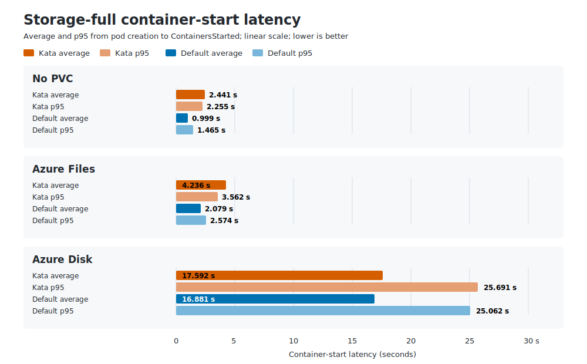

# Kata Performance Suite

`kata-perf` compares Kata and default-runtime pod startup on AKS. Serialized
modes isolate baseline startup latency, while offered-load modes show how
latency and achieved Ready throughput change as pod creation QPS rises. The
storage modes additionally compare direct pause pods with no volume, Azure Disk,
and Azure Files. The suite separates end-to-end sandbox readiness, the CRI
`RunPodSandbox` call, and post-sandbox container launch.

## What It Tests

- Runs Kata first with `runtimeClassName: kata-vm-isolation`, then the default
  runtime without a runtime class.
- Serialized modes wait for each pod; offered-load modes create at a fixed QPS
  and wait only after all 20 pods have been submitted.
- Uses `mcr.microsoft.com/oss/v2/kubernetes/pause:3.10.2`, preloaded before the
  jobs start.
- Schedules workload pods only on Azure Linux nodes labeled
  `perf.azure.com/node-role=workload`.
- Deletes all namespaces from the first runtime before the second starts.
- Pins installed Prometheus to the AKS system node pool.

## Modes

| Mode | Samples per runtime | Iterations per namespace | QPS | Burst | Drain pause |
| --- | ---: | ---: | ---: | ---: | ---: |
| `smoke` | 5 | 1 | 5 | 5 | 1 minute |
| `full` | 20 | 1 | 5 | 5 | 1 minute |
| `load-qps-1` | 20 | 20 | 1 | 1 | 1 minute |
| `load-qps-2` | 20 | 20 | 2 | 1 | 1 minute |
| `load-qps-5` | 20 | 20 | 5 | 1 | 1 minute |
| `storage-smoke` | 5 | 1 | 5 | 5 | 1 minute |
| `storage-full` | 20 | 1 | 5 | 5 | 1 minute |

The serialized jobs use `podWait: true` and `waitWhenFinished: false`. In kube-burner
2.7.3 this combination waits after every iteration. One namespace per
iteration prevents a previously waited namespace from allowing later pods to
queue. QPS and burst limit Kubernetes API traffic; they do not provide the
serialization.

The offered-load jobs use `podWait: false`, `waitWhenFinished: true`, and one
shared namespace per runtime. `burst: 1` avoids an initial token-bucket spike,
so QPS is the intended pod submission rate. A final readiness barrier keeps the
measurement open until submitted pods are Ready. Kata remains first.

The storage modes run six fixed jobs in this order: Kata/default with no PVC,
Kata/default with `managed-csi`, then Kata/default with `azurefile-csi`. Each
iteration has its own namespace and creates one direct pause pod; PVC jobs also
create exactly one claim and enable per-job `pvcLatency` and garbage collection.
The dedicated pod templates set `automountServiceAccountToken: false`.

Before execution, the runner verifies that `managed-csi` uses
`disk.csi.azure.com`, `azurefile-csi` uses `file.csi.azure.com`, and both classes
use `reclaimPolicy: Delete`. Their binding modes and parameters are written to
`metadata/run.yml`. A ConfigMap in `kube-system` atomically prevents concurrent
storage runs. The runner normally deletes it on exit; after a crashed run,
verify no storage run is active and delete the stale lock with
`kubectl -n kube-system delete configmap aks-burner-storage-startup-lock` using
the same kube context.

PVC-job hooks capture bound PV names before garbage collection and wait up to 15
minutes for each PV and associated VolumeAttachment to disappear. Timeout and
RBAC failures report the stuck resources and manual investigation guidance.

### Storage Startup Measurements

PVC-backed jobs enable kube-burner `pvcLatency`. The report emits PVC binding
p50, p95, maximum, average, expected, valid, and missing sample counts by job and
StorageClass. kube-burner measures from its PVC watcher observation until the
claim reaches Bound; this is not an API-server request-duration metric.

For every storage-mode pod, reporting derives:

`readyToStartContainersLatency - schedulingLatency`

and emits it as `scheduled_to_ready_to_start_containers_latency`. In Kubernetes
1.36 this interval ends after required volumes are mounted and the pod sandbox
and networking are ready, so it is deliberately not named CSI or storage-only
latency. The no-PVC job for the same runtime is the comparison baseline. Do not
subtract independently computed percentiles as if they were paired samples;
compare the distributions across repeated runs instead.

The underlying timestamps can make a fast interval non-positive. Reporting
keeps these as `ambiguous_count` rather than including them in percentiles, and
also emits expected, valid, and missing counts. Storage modes require all six
job summaries from one kube-burner UUID and validate pod/PVC iteration,
replica, namespace, name, and StorageClass identities before writing results.

Prometheus closes each job's metric window after the one-minute event-drain
pause. This guarantees multiple 15-second Prometheus scrapes even when five
serialized pods start quickly. No additional sandbox operations occur during
the pause. Per-job garbage collection then waits for namespace deletion before
the next runtime starts.

## Measurements

### Sandbox Ready

kube-burner `PodReadyToStartContainers` quantiles report elapsed time from pod
creation until Kubernetes says the sandbox and networking are ready. This
includes scheduling and kubelet queueing before the CRI call.

### CRI Sandbox Call

Prometheus reports `runPodSandboxCount` and `runPodSandboxMean` from
`kubelet_run_podsandbox_duration_seconds_count` and `_sum`, filtered to the
workload node and grouped by `runtime_handler`. The empty default handler is
shown as `default`; Kata is shown as `kata`.

The suite captures raw counters at each job's exact start and end; reporting
derives the count delta and mean from those values. CRI retries or unrelated
workload-node pods can still add operations, so handler labels and counts remain
visible rather than being collapsed into one runtime value.
Histogram p95/p99 are intentionally omitted: this ALPHA metric's final finite
default bucket is 10 seconds, so slower calls make high quantiles infinite.

### Post-Sandbox Container Launch

The reporter derives per-pod launch latency as:

`containersStartedLatency - readyToStartContainersLatency`

It reports p50, p95, p99, max, average, and valid sample count for each runtime
job. Kube-burner condition timestamps have one-second precision, so a valid
subsecond sandbox-ready transition can appear as zero and is excluded as
ambiguous. The sample-count row makes this visible. Missing container-start
events, malformed fields, and negative differences fail reporting.

### Offered-Load Readiness

Only `load-qps-*` modes derive `pod_ready_throughput` and
`pod_ready_missing_count`. Throughput is Ready pod samples divided by the
interval from the first pod's creation to the final sampled Ready timestamp, so
the one-minute Prometheus drain pause is excluded. The missing count is the
configured 20 pods minus Ready samples. It cannot distinguish pod creation
failure, timeout, or a missing measurement, so it is intentionally not labeled
as a failure count. If kube-burner fails after writing usable load data, the
runner still writes the available rows with `runStatus=partial` and returns the
original kube-burner error; jobs without local-indexer data are not invented.

Run each QPS point three to five times on comparable cluster capacity before
comparing the latency-versus-load curve:

```sh
TEST_SUITE=kata-perf TEST_MODE=load-qps-1 make run-suite
TEST_SUITE=kata-perf TEST_MODE=load-qps-2 make run-suite
TEST_SUITE=kata-perf TEST_MODE=load-qps-5 make run-suite
```

## Storage Full Result: 2026-07-18T03:45:01Z

Source: `results/2026-07-18T03-45-01.8100281Z_kata-perf_storage-full/summary/results.csv`

Each runtime and storage combination expected 20 pods. The chart compares
end-to-end `ContainersStarted` latency from pod creation; lower is better. The
tables are authoritative.



| Storage | Runtime | Containers started average | p95 | Maximum | CRI sandbox mean (count) |
| --- | --- | ---: | ---: | ---: | ---: |
| No PVC | Kata | 2.441 s | 2.255 s | 14.414 s | 1.721 s (20) |
| No PVC | Default | 0.999 s | 1.465 s | 1.521 s | 0.403 s (21) |
| Azure Files | Kata | 4.236 s | 3.562 s | 26.126 s | 1.110 s (20) |
| Azure Files | Default | 2.079 s | 2.574 s | 2.767 s | 0.360 s (20) |
| Azure Disk | Kata | 17.592 s | 25.691 s | 28.261 s | 1.092 s (20) |
| Azure Disk | Default | 16.881 s | 25.062 s | 25.494 s | 0.417 s (21) |

`Valid` applies to the scheduled-to-sandbox-ready interval. PVC binding is a
separate kube-burner measurement; all four PVC groups had 20/20 valid samples.

| Storage | Runtime | Scheduled to sandbox ready average | p95 | Maximum | Valid | PVC binding average | p95 | Maximum |
| --- | --- | ---: | ---: | ---: | ---: | ---: | ---: | ---: |
| No PVC | Kata | 1.268 s | 1.072 s | 13.328 s | 20/20 | N/A | N/A | N/A |
| No PVC | Default | 0.230 s | 0.426 s | 0.538 s | 6/20 | N/A | N/A | N/A |
| Azure Files | Kata | 1.194 s | 1.647 s | 2.006 s | 20/20 | 1.866 s | 1.002 s | 22.494 s |
| Azure Files | Default | 0.450 s | 0.881 s | 0.921 s | 16/20 | 0.734 s | 1.003 s | 1.122 s |
| Azure Disk | Kata | 13.769 s | 15.352 s | 20.308 s | 20/20 | 2.365 s | 10.817 s | 11.119 s |
| Azure Disk | Default | 9.824 s | 13.370 s | 15.422 s | 20/20 | 5.652 s | 10.954 s | 11.085 s |

### Findings

- Azure Disk had the highest container-start latency for both runtimes. Kata and
  default averages were 17.592 and 16.881 seconds; p95 values were 25.691 and
  25.062 seconds.
- Kata's average was 2.04 times default with Azure Files (4.236 versus 2.079
  seconds) and 2.44 times default without a PVC (2.441 versus 0.999 seconds).
- Azure Files had a Kata PVC-binding outlier of 22.494 seconds while its p95 was
  1.002 seconds. The same scenario's container-start maximum was 26.126 seconds
  versus a 3.562-second p95. Kata without a PVC also had a 14.414-second maximum
  versus a 2.255-second p95. Repeat runs and raw-event review are needed to
  characterize these tails.

Sample quality limits interpretation. Default Azure Files and no-PVC had only
16/20 and 6/20 valid scheduled-to-sandbox-ready intervals because 4 and 14 were
non-positive and classified as ambiguous. Default no-PVC also had only 7/20
valid post-sandbox launch samples. The two default-runtime CRI counts of 21 show
that an extra sandbox operation may affect those means. The CSV defines no
threshold or pass/fail result, and one run is not a durable baseline.

## Serialized Full Result: 2026-07-14T18:58:30Z

Result file:

`results/2026-07-14T18-58-30.413356933Z_kata-perf_full/summary/results.csv`

The run created 20 pods serially for each runtime. The kube-burner log shows a
wait for every iteration and deletion of all 20 Kata namespaces before the
default-runtime job started. No benchmark namespaces remained afterward.

| Runtime | Sandbox-ready p50 | Sandbox-ready p95 | Sandbox-ready p99 | CRI sandbox count | CRI sandbox mean | Post-sandbox p50 | Post-sandbox p95 | Valid launch samples |
| --- | ---: | ---: | ---: | ---: | ---: | ---: | ---: | ---: |
| Kata | 1.000 s | 2.000 s | 2.000 s | 20 | 1.111 s | 0.856 s | 1.195 s | 20/20 |
| Default | 1.000 s | 1.000 s | 1.000 s | 20 | 0.391 s | 0.561 s | 0.818 s | 15/20 |

These full-run launch percentiles were produced before the adapter was aligned
to kube-burner's pinned percentile algorithm. The count/mean and lifecycle
values remain valid; replace the launch percentile values after the next
serialized full run.

One run is not a stable baseline. Repeat runs on comparable cluster capacity
before drawing performance conclusions.
